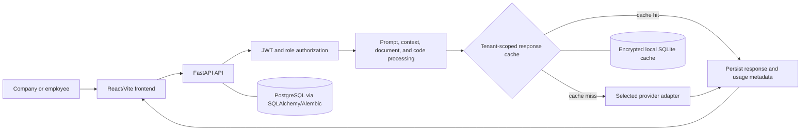

# TokenPilot

TokenPilot is a multi-user AI workspace for company and employee teams. It routes requests through configurable AI providers and combines authenticated workspaces, usage controls, deterministic prompt/context optimization, document and code processing, analytics, and tenant-scoped response caching.

## Features

- Company and employee authentication with OTP verification, password reset, bcrypt password hashing, JWT bearer tokens, and role-based access control.
- Organization management with invitations, employee hierarchy, team roles, notifications, API-key approval workflows, and token budgets.
- AI chat workspaces with conversation history, provider/model connections, encrypted personal and company API keys, file attachments, and optimization analytics.
- Deterministic prompt cleanup, relevance-based conversation-context selection, PDF/DOCX/text processing, and code/language/dependency selection.
- Exact and semantic response caching with private and eligible tenant-global scopes, single-flight request coalescing, and optional encrypted SQLite persistence.
- Provider adapters for OpenAI-compatible APIs, Gemini, and Anthropic-compatible requests, including configurable providers such as Groq, OpenRouter, DeepSeek, Mistral, and xAI.
- Token estimates, estimated cost, latency, provider/model metadata, optimization reports, dashboards, uploads, support reports, and an optional Electron-based desktop shell.

## Tech Stack

### Frontend

- React, Vite, React Router, Axios
- Monaco Editor integration, Recharts, Framer Motion, and Lucide React
- Tailwind CSS/PostCSS
- Electron and `node-pty` for the optional desktop/AI IDE experience

### Backend

- Python 3.10+, FastAPI, Pydantic Settings
- SQLAlchemy and Alembic
- PostgreSQL through `psycopg2-binary`
- JWT authentication with `python-jose`; password hashing with Passlib/bcrypt
- HTTPX, `pypdf`, `tiktoken`, and pytest

### Supporting services

- SMTP for OTP, password-reset, invitation, and account emails
- Local encrypted SQLite persistence for the response cache

## Architecture



The backend is organized around FastAPI routers, security and configuration modules, SQLAlchemy models/schemas, the AI service pipeline, provider adapters, optimization modules, caching, and usage/analytics services.

## Request and Data Flow

1. The frontend sends an authenticated request with a JWT bearer token.
2. The workspace loads the relevant conversation, files, provider connection, and tenant-scoped settings.
3. The backend classifies the request and preprocesses the prompt, conversation context, documents, and code.
4. Private and eligible tenant-global cache entries are checked using exact and semantic matching.
5. On a cache miss, the selected provider adapter sends the request to the configured AI provider.
6. The user message, assistant response, token usage, estimated cost, latency, provider/model, and optimization report are persisted.

## Getting Started

### Prerequisites

- Python 3.10 or newer
- A supported Node.js installation and npm
- PostgreSQL
- SMTP credentials for email-based verification and invitations

### Backend

From the repository root:

```powershell
cd Backend
python -m venv venv
.\venv\Scripts\Activate.ps1
pip install -r requirements.txt
Copy-Item .env.example .env
```

Fill in the required values in `Backend/.env`, configure a PostgreSQL database, then run migrations and start the API:

```powershell
alembic upgrade heads
uvicorn app.main:app --reload
```

The API runs on Uvicorn's default local address. FastAPI documentation is available at `/docs` and `/redoc` while the server is running.

For macOS/Linux, activate the virtual environment with `source venv/bin/activate` and copy the environment file with `cp .env.example .env`.

### Frontend

In a second terminal:

```powershell
cd Frontend
npm install
npm run dev
```

The Vite development server runs on port `5173` and proxies backend routes to `http://127.0.0.1:8000`. For a separately hosted backend, set `VITE_API_URL` in a frontend environment file. Build the frontend with `npm run build`.

The optional Electron development shell can be started with:

```powershell
npm run desktop:dev
```

## Environment Variables

Backend configuration is documented in [`Backend/.env.example`](Backend/.env.example). It includes database, JWT, email/SMTP, frontend-origin, API-key encryption, optimization, and response-cache settings. Copy it to `Backend/.env` and replace only the placeholders with deployment-specific values. Never commit `.env` or real credentials.

When the frontend and backend are hosted on different origins, configure `VITE_API_URL` for the frontend. During local development, the Vite proxy normally makes this unnecessary.

## Testing

With the backend virtual environment active and its environment/database configured:

```powershell
cd Backend
pytest -q
```

## Deployment Notes

- Run Alembic migrations against PostgreSQL before serving requests.
- Use strong, unique JWT and API-key-encryption secrets and keep SMTP/database credentials outside source control.
- The response cache uses process memory with optional encrypted SQLite persistence at a local path. It is instance-local and is not a shared cache for horizontally scaled deployments.
- Uploaded files are served from the backend's local `uploads` directory. Cloud deployments should provide persistent storage and an appropriate reverse-proxy/storage strategy.
- Configure CORS/origin and frontend URL settings consistently when frontend and backend are deployed separately.

## Project Status

Deployed on AWS and available for demonstration.

## Live Demo

[TokenPilot](YOUR_DEPLOYED_URL)


## License

License will be added.
